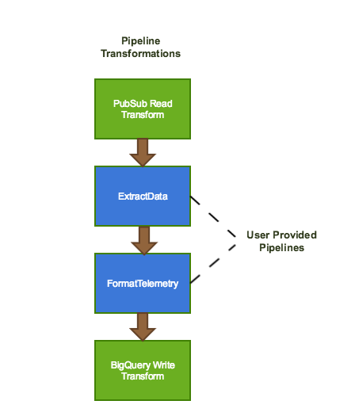
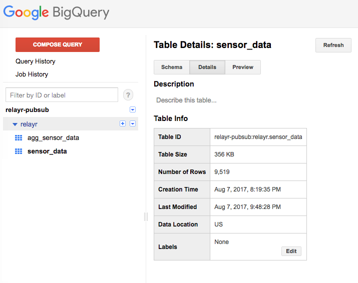
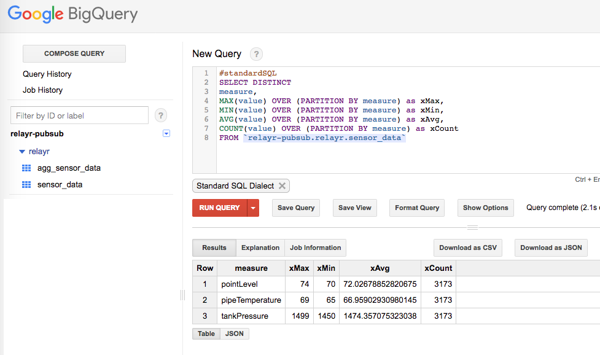
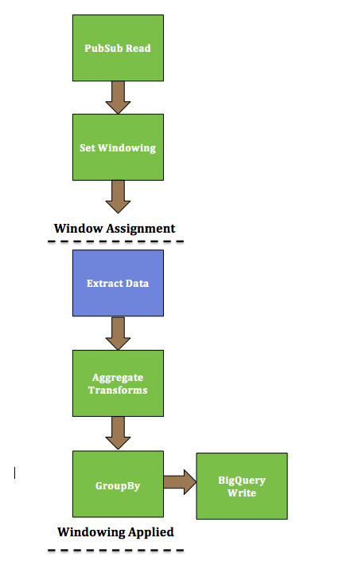
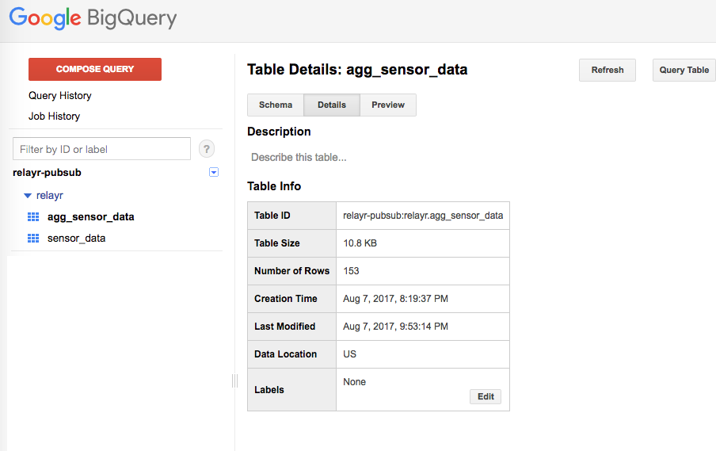
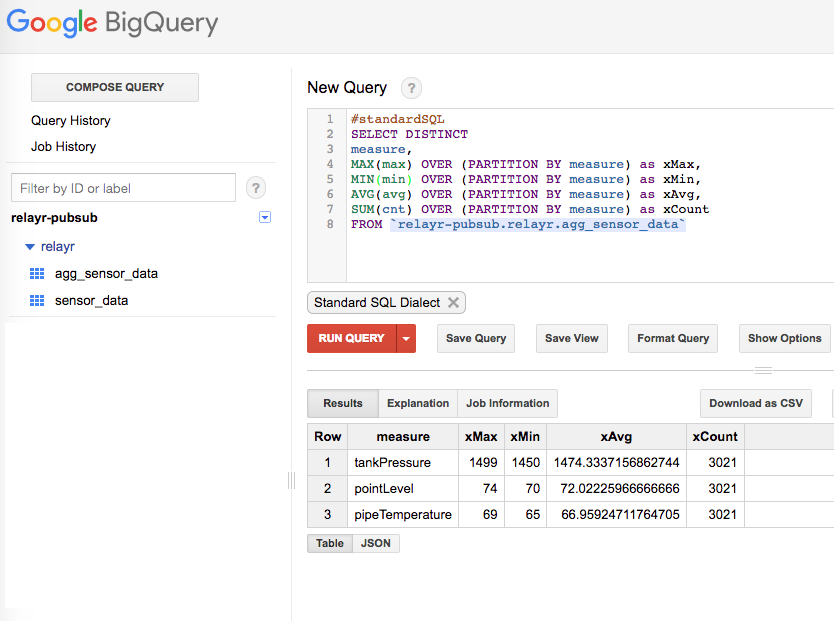

# Examination of Sensor Data and It's Impact on The "Cloud".

| Author | Chris Crawford <chris.crawford@relayr.io> |
|:------------|:------------------------------------|

##### IoT data usage by 2018 is expected to reach 403ZBs.  Companies looking to leverage IoT data analytics will need to rethink their data center infrastructures and strategies.  

##### Leveraging [Google Cloud Platform (GCP)][7] and [relayr.io][8] we will highlight the impact that IoT sensor data can have and how we can create Pipelines to reduce the data.

#####This example is broken down into the following steps.

|     Step    |      Source                                |
|:------------|:------------------------------------|
| Source | Relayr Cloud |
| Extract & Transform | Google Cloud Platform (AppEngine) |
| Analytics | Google Cloud Platform (BigQuery) |


## Source

##### On [developer.relayr.io] (https://developer.relayr.io) we have a device model with the following readings:

* Pipe Temperature
* Tank Pressure
* Point Level

##### Leveraging [Google Cloud Platform][7] we have deployed a simple Node.js application that poles the devices [readings] (https://docs.relayr.io/api/cloud/devices/#last-data-received-from-device) and publishes the data to to a Cloud Pub/Sub topic.  

##### This example assumes that the Pub/Sub topic exists and that for this streaming dataset it is [projects/relayr-pubsub/topics/sensordata][6]	


### References

[Relayr Cloud Getting Started][1]


## Extract & Transform

##### The following high-level diagram outlines the dataflow pipeline that will process the data stream that is available as a Cloud Pub/Sub topic and then write it to a BigQuery output for additional analytics.

##### This example is based off of the [StreamingWordExtract][5] which leverages the [common classes][4] for setup and tear down of GCP resources.  




 
### Pipeline Code

```java
StreamingDataExtractOptions options = PipelineOptionsFactory.fromArgs(args)
        .withValidation()
        .as(StreamingDataExtractOptions.class);
    options.setStreaming(true);
    options.setBigQuerySchema(FormatTelemetryFn.getSchema());
    ExampleUtils exampleUtils = new ExampleUtils(options);
    exampleUtils.setup();

    Pipeline pipeline = Pipeline.create(options);
    TableReference tableRef = new TableReference();
    tableRef.setProjectId(options.getProject());
    tableRef.setDatasetId(options.getBigQueryDataset());
    tableRef.setTableId(options.getBigQueryTable());

    PCollection<String> p = pipeline.apply("ReadPubSub", PubsubIO.readStrings().fromSubscription(options.getPubsubSubscription()));
```    

##### Here we create the pipeline and a data PCollection by reading from PubSub. The existing PubSub topic and subscription are passed in as application arguments. It will read data from an existing PubSub that streams our devices current readings.
 
##### Since we are dealing with streaming data it is necessary to break it up into chunks so that it can be processed individually. Here our main input is windowed using fixed-time windows of one minute. 

```Java
PCollection<String> p_windowed = p.apply(Window.<String>into(FixedWindows.of(Duration.standardMinutes(1))));
```

##### Next we will transform our collection of sensor data into a collection of Telemetry objects.

```Java

 PCollection<Telemetry> t = p_windowed.apply(ParDo.of(new ExtractDataFn()));

```
##### Next we will transform our collection of Telemetry objects into a collection of TableRows that will be used to write the results to BigQuery.

```Java
PCollection<TableRow> results = t.apply(ParDo.of(new FormatTelemetryFn()));
    results.apply(BigQueryIO.writeTableRows().to(tableRef).withSchema(FormatTelemetryFn.getSchema()));
```

##Analytics

##### In less than an hour we have written 9,519 records.



##### Using the following query we can easily run analytics over the captured data.  Here we are aggregating the sensor data.

```sql
#standardSQL
SELECT DISTINCT
measure,
MAX(value) OVER (PARTITION BY measure) as xMax,
MIN(value) OVER (PARTITION BY measure) as xMin,
AVG(value) OVER (PARTITION BY measure) as xAvg,
COUNT(value) OVER (PARTITION BY measure) as xCount
FROM `relayr-pubsub.relayr.sensor_data`
```

| Measure | xMax |  xMin |  xAvg |  xCount |
|:--------|:-----|:--------|:------|:------|
| pointLevel| 74 | 70 | 72.02678852820675 | 3173 |
| pipeTemperature| 69 | 65 | 66.95902930980145 | 3173 |
| tankPressure| 1499 | 1450 | 1474.357075323038 | 3173 |




## Further Refinement

##### We can further enhance our Pipeline by reducing the collected data and writing the aggregated results to BigQuery. 



#### Windowing (Window Assignment)

```Java
PCollection<String> p = pipeline.apply("ReadPubSub", PubsubIO.readStrings().fromSubscription(options.getPubsubSubscription()));

PCollection<String> p_windowed = p.apply(Window.<String>into(FixedWindows.of(Duration.standardMinutes(1))));
    
PCollection<Telemetry> t = p_windowed.apply(ParDo.of(new ExtractDataFn()));

```
#### Extract Data & Transform Data


```Java
PCollection<KV<String, Integer>> mv = t.apply(ParDo.of(new ExtractMeasureValueFn()));
PCollection<KV<String, Integer>> maxPerKey = mv.apply(Max.<String>integersPerKey());
PCollection<KV<String, Integer>> minPerKey = mv.apply(Min.<String>integersPerKey());
PCollection<KV<String, Double>> meanPerKey = mv.apply(Mean.<String, Integer>perKey());
PCollection<KV<String, Long>> cntPerKey = mv.apply(Count.<String, Integer>perKey());

```


#### Grouping Collections (Windowing Applied)


```Java

PCollection<KV<String, CoGbkResult>> coGbkResultCollection =
    KeyedPCollectionTuple.of(tag1, maxPerKey)
                         .and(tag2, minPerKey)
                         .and(tag3, meanPerKey)
                         .and(tag4, cntPerKey)
                         .apply(CoGroupByKey.<String>create());

// Create a collection reflecting the aggregrated results. 
PCollection<AggTelemetry> aggResults = 
  coGbkResultCollection.apply(ParDo.of(new DoFn<KV<String, CoGbkResult>, AggTelemetry>() { 
     @ProcessElement
     public void processElement(ProcessContext c) {
     
     AggTelemetry at = new AggTelemetry(c.element().getKey(), c.element().getValue().getOnly(tag1), c.element().getValue().getOnly(tag2), 
     c.element().getValue().getOnly(tag3).floatValue(),  
     c.element().getValue().getOnly(tag4), c.timestamp().toString());

      c.output(at); 
     } 
})); 
 
PCollection<TableRow> ar = aggResults.apply(ParDo.of(new FormatAggTelemetryFn()));
    ar.apply(BigQueryIO.writeTableRows().to(aggTableRef).withSchema(FormatAggTelemetryFn.getSchema())); 
```

## Analytics

##### Over the same time period, using further refinement, we have written only 153 records versus 9,519.



##### As before, using a similar query, we can see that by adding further aggregating transformations in our pipeline we can still get surprisingly similar results with fewer records.


```sql
#standardSQL
SELECT DISTINCT
measure,
MAX(max) OVER (PARTITION BY measure) as xMax,
MIN(min) OVER (PARTITION BY measure) as xMin,
AVG(avg) OVER (PARTITION BY measure) as xAvg,
SUM(cnt) OVER (PARTITION BY measure) as xCount
FROM `relayr-pubsub.relayr.agg_sensor_data`
```

| Measure | xMax |  xMin |  xAvg |  xCount |
|:--------|:-----|:--------|:------|:------|
| (Agg) pointLevel| 74 | 70 | 72.02225966666666 | 3021 | 
| pointLevel| 74 | 70 | 72.02678852820675 | 3173 |
| (Agg) pipeTemperature| 69 | 65 | 66.95924711764705 | 3021 |
| pipeTemperature| 69 | 65 | 66.95902930980145 | 3173 |
| (Agg) tankPressure| 1499 | 1450 | 1474.3337156862744 	| 3021 |
| tankPressure| 1499 | 1450 | 1474.357075323038 | 3173 |





## Conclusion

While we are able to reduce our overall static data consumption we are still sending and processing that data on the cloud which can result in increased costs.

A good IoT strategy will account for co-locating edge devices that have the capabilities to reduce the data locally before it even gets transmitted to the cloud.

Furthermore, a solid solution will have real-time (edge) and batch (cloud) analytic capabilities to meet a wide variety of needs from security to predictive maintenance.


[1]: https://docs.relayr.io/cloud/getting-started/

[2]: https://beam.apache.org/documentation/runners/direct/

[3]: https://cloud.google.com/blog/big-data/2016/04/scheduling-dataflow-pipelines-using-app-engine-cron-service-or-cloud-functions

[4]: https://github.com/apache/beam/tree/master/examples/java/src/main/java/org/apache/beam/examples/common

[5]: https://github.com/apache/beam/blob/master/examples/java/src/main/java/org/apache/beam/examples/complete/StreamingWordExtract.java

[6]: https://cloud.google.com/pubsub/docs/quickstart-console

[7]: https://cloud.google.com

[8]: https://relayr.io
